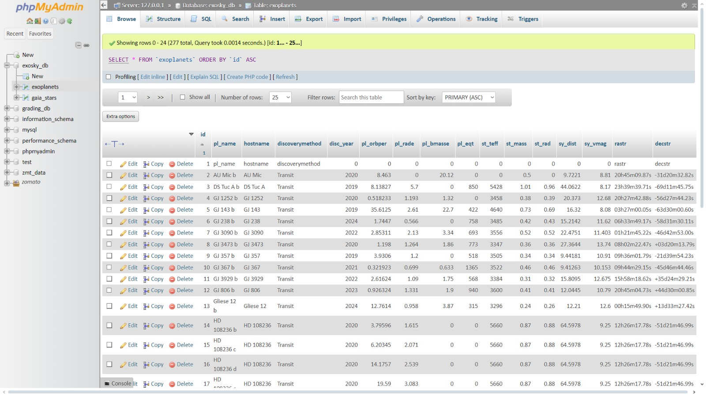
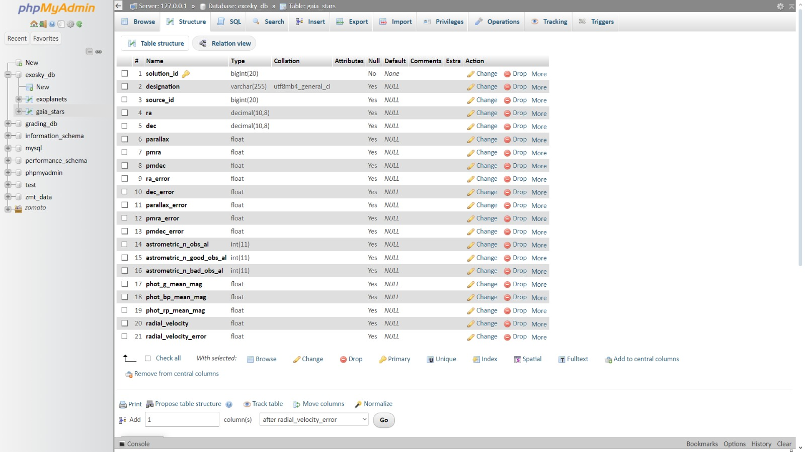

# Exosky: Visualizing the Night Sky from Exoplanets

## Table of Contents
- [Project Overview](#project-overview)
- [Features](#features)
- [Datasets](#datasets)
- [MySQL Database](#mysql-database)
- [Data Profiling & Visualization](#data-profiling--visualization)
- [Jupyter Notebooks](#jupyter-notebooks)
- [Future Work](#future-work)

---

## Project Overview
**Exosky** allows students to explore the night sky from exoplanets, visualizing star fields based on data from NASA's Exoplanet Archive and the Gaia DR3 Star Catalog. Users can generate star charts, name constellations, and even explore the sky through virtual reality.

## Features
- Select an exoplanet and generate its unique "exosky."
- Interactive sky charts with adjustable star brightness, and grids.
- 3D point cloud visualizations of stars.
- Export star charts as PDFs or explore them in virtual reality.

## Datasets
This project uses two primary datasets:
1. **NASA Exoplanet Archive**: [Sample CSV](datasets/NASA_Exoplanet_sample.csv)
2. **Gaia DR3 Catalog**: [Sample CSV](datasets/Gaia_DR3_Catalog_sample.csv)

## MySQL Database 

The datasets are loaded into a MySQL database to facilitate efficient querying and manipulation. The database helps manage the vast number of records from the star catalogs and exoplanet archive.
Sample image of Database:

### Database Schema

## Data Profiling & Visualization
The project includes a set of data profiling and visualization notebooks that explore the datasets:
1. **Data Profiling**: Insights into the structure and quality of the data using Python tools like `pandas`, `seaborn`, and `matplotlib`.
   
   👉🏻 **Data Profiling Full Report**: [Download Data Profiling Report](https://raw.githubusercontent.com/<your-username>/<repository-name>/main/reports/data_profiling.html)
     
   

3. **Data Visualization**: Plots and graphs representing different star properties, exoplanet characteristics, etc.
   
   

## Jupyter Notebooks

Explore the data profiling and visualization work in these Jupyter notebooks:

- [Data Profiling Notebook](notebooks/nasa_app_innovation.ipynb): Profiling the datasets using `pandas` and generating insights.
- [Data Visualization Notebook](notebooks/nasa_app_innovation.ipynb): Visualizing star data from the exoplanet archive and Gaia catalog using `matplotlib` and `seaborn`.

## Future Work
- Some exciting future features that could enhance the Exosky experience:
- Real-time 3D visualizations with Three.js or Plotly.
- A public web interface for interactive star exploration.
- Incorporating additional datasets for more comprehensive sky visualizations.
